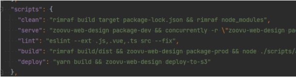
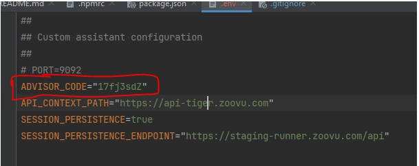
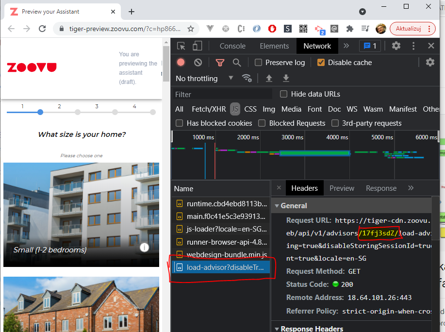
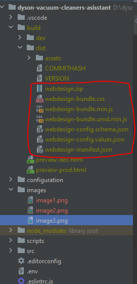

# **Technical documentation for Dyson Vacuum Cleaners digital assistant:**


# **Prerequisites**


* access to files repository: \
  [https://github.com/kfedorowzoovu/dyson-vacuum-cleaners](https://github.com/kfedorowzoovu/dyson-vacuum-cleaners)
* access to public zoovu npm packages - already linked in package.json
* some IDE or code editor (f.e.: Webstorm, Visual Studio Code)
* some command line tool (default windows console is not recommended, alternatively use gitbash or powershell, Mac OS Terminal should be fine)
* node js and npm (nvm is also recommended to switch between node versions - currently the one used in the project is node v14.15.2)
* yarn package manager (preferred over npm)
* some server credentials for theme deployment


# **Zoovu NPM packages**


### **Overview**

Every 4.x runner design uses NPM packages which make bootstrapping the project as easy as it possible and helps with maintaining versioning of the runner logic part. There are 3 existing private packages, which are using **@zoovu** domain.

**Packages names: **


1. runner-browser-api
2. runner-browser-test-utils
3. runner-web-design-base


---


### **Zoovu packages usage**


```
There is no need to register the other packages. Since they are used as dependencies for runner-web-design-base they are downloaded to the node_modules' @zoovu domain directory as well.
```


Every theme requires a **runner-web-design-base **package to be installed. It must be registered as theme/ design dependency in the package.json file. Which version should be integrated would have to be checked on some up to date theme.


```
"dependencies": {
    "@zoovu/design-system": "^4.21.1",
    "@zoovu/runner-browser-api": "~4.28.0",
    "@zoovu/runner-browser-test-utils": "~4.28.0",
    "@zoovu/runner-web-design-base": "~4.30.0"
},
```


## **Running 4.x themes/ designs**


### **npm/yarn scripts**

Available commands can be found in the package.json file of each design/theme.





### **Getting started**

Once you have your repository cloned and available on your local environment, you need to install all dependencies described in package.json using:

```
yarn install
```


Next, you need to go to .env file and insert correct ADVISOR_CODE:





You can check assistant’s code by opening current draft or live version preview from the platform and navigating to load-advisor.js script as shown below:





Once you input desired assistant code to .env file, you should run:


```
yarn serve
```


This will create a full local build of the project and open a local preview in the browser's window.

**Deployment**

In order to deploy you custom design, you need to run:


```
yarn build
```


This will create a production package of the project. All of following files must be uploaded to a server and linked to the assistant on Zoovu platform:




